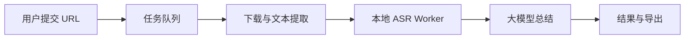

# Downspace 产品需求文档

版本：V1.0 草案
日期：2026-07-01
状态：产品方向锚定,用于对齐当前与后续迭代

替代关系：本文取代 `transcription-product-spec.md` 中关于"整体产品定位"的表述。转写子系统的模块级设计仍以 `transcription-architecture-research.md`、`funasr-provider-spec.md` 为准。

---

## 一、产品定位

一句话:**把散落在视频和帖子里的知识,转化为可验证、可复习、可编辑、可带走的个人笔记。**

- **核心对象**:知识笔记,不是下载文件
- **核心动作**:粘贴一条链接
- **核心结果**:结构化、可追溯、可编辑的学习总结
- **核心指标**:笔记被再次打开、编辑或导出的比例,而不是下载次数

下载、FFmpeg、ASR、大模型都退到后台,作为流水线能力存在,首页不再是它们的展台。

---

## 二、目标用户与场景

**当前阶段:本地优先,不服务外网匿名用户**。用户即产品负责人自己,以及未来邀请制的小范围测试者。

典型场景:
- 看完一节 B 站课程,想要一份带时间戳、可复习的要点笔记
- 收藏了一批小红书图文,希望结构化整理为可搜索的知识片段
- 需要把访谈、播客中的关键观点导入 Obsidian 库

不服务的场景:
- 高频匿名下载
- 面向公众开放的 SaaS 转写
- 抖音、YouTube、直播录制、多语言实时字幕

---

## 三、产品原则

1. **本地优先**:数据、模型、密钥默认留在本机;历史记录不依赖登录
2. **内容模态优先**:能用文本就不 OCR,能用原生字幕就不 ASR
3. **可追溯**:每条结论都能回到来源(时间戳或原文段落)
4. **可编辑**:结果页支持修改、重新生成局部章节
5. **成本透明**:任何外部计费动作前必须获得身份、额度与预算授权
6. **稳定优先于覆盖**:先把一条平台的一条链路做到极稳,再扩
7. **克制的内容,有性格的交互**:结果页安静可读;等待、空态、跳转、错误允许表达。详见第八节

---

## 四、MVP 范围

**做**:
- B 站视频(优先原生字幕)
- 小红书图文
- 小红书视频
- 本地 FunASR 作为默认 ASR
- 讯飞作为高质量兜底(BYOK)
- 一个默认"学习笔记"模板 + 高级 Prompt 自定义
- Markdown / Obsidian 导出
- 本地历史记录

**不做(第一版)**:
- 抖音、YouTube
- 前台多 ASR Provider 选择器(Provider 接口保留,UI 不暴露)
- 独立字幕编辑器
- Notion 原生同步(仅提供 Notion 兼容 Markdown 复制)
- 复杂下载预设

---

## 五、核心链路

```
URL
  → 平台识别 (Resolver)
  → 内容解析 (Extractor)
  → 判断包含哪些模态: 文本 / 字幕 / 音频 / 图片 / 元数据
  → 按优先级选择最便宜、最准确的提取方式
  → 汇聚为 Canonical Document
  → Knowledge Processor 生成笔记
  → Exporter 输出
```

**内容提取优先级**:
1. 平台原生正文或字幕(零 ASR 成本)
2. 页面结构化信息
3. 图片 OCR
4. 音频转写(仅在前三者不足时)

**分阶段流式处理**:
```
内容提取 → 分段转写 → 每段生成局部要点
  → 全部完成 → 归一化文本 → 生成最终综合笔记
```

界面实时展示阶段性结果,但最终总结必须等完整文本归一后生成。

---

## 六、Canonical Document 模型

所有平台、所有 Provider 都收敛到一个统一结构,再由下游消费:

```json
{
  "source": {
    "platform": "bilibili | xiaohongshu",
    "url": "...",
    "title": "...",
    "author": "...",
    "duration": 1832,
    "capturedAt": "2026-07-01T..."
  },
  "textBlocks": [
    { "type": "paragraph", "text": "..." }
  ],
  "timeline": [
    { "start": 0, "end": 5.2, "speaker": "s1", "text": "..." }
  ],
  "images": [
    { "url": "...", "ocr": "..." }
  ],
  "metadata": {
    "hasNativeSubtitle": true,
    "asrProvider": "local-funasr",
    "confidence": 0.92
  }
}
```

**Provider 统一输出**(转写、OCR、正文提取):

```json
{
  "provider": "local-funasr",
  "language": "zh-CN",
  "duration": 1832,
  "text": "...",
  "segments": [ { "start": 0, "end": 5.2, "speaker": "s1", "text": "..." } ],
  "usage": { "audioSeconds": 1832, "estimatedCost": 0 }
}
```

下游(总结、引用、字幕、导出)不需要知道底层供应商。

---

## 七、信息架构与页面设计

### 首页

```
┌────────────────────────────────────────────┐
│ Downspace              历史笔记   设置      │
│                                            │
│ 把一条链接,变成一份能复习的笔记。          │
│                                            │
│ ┌──────────────────────────────────────┐   │
│ │ 粘贴 B站或小红书链接…                 │ →│
│ └──────────────────────────────────────┘   │
│                                            │
│ 支持:B站视频 · 小红书图文与视频            │
│ 原始媒体处理后自动清理                     │
│                                            │
│ 最近生成                                   │
│ [笔记卡片] [笔记卡片] [笔记卡片]           │
└────────────────────────────────────────────┘
```

### 处理中

进度不是百分比,而是"系统正在理解什么":

```
✓ 已识别:B站视频
✓ 已取得标题和简介
✓ 已发现原生字幕
● 正在整理完整文本
○ 正在生成学习笔记
○ 准备导出
```

### 结果页(总结 + 证据 双栏)

```
┌────────────────────────────────────────────┐
│ 标题 / 作者 / 来源 / 时长       导出 ▾      │
├───────────────────┬────────────────────────┤
│ 学习笔记          │ 原文与转录             │
│                   │                        │
│ 一句话总结        │ 00:00 …                │
│ 核心观点          │ 03:24 …                │
│ - 观点 [03:24]    │ 08:12 …                │
│ - 观点 [08:12]    │                        │
│ 内容结构          │                        │
│ 行动建议          │                        │
└───────────────────┴────────────────────────┘
```

左侧结论上的时间戳可点,跳转右侧原文对应位置。

### 工具箱(旧首页功能降级到此)

- 单独下载媒体
- 上传本地音视频转文字
- 字幕格式转换

### 设置

- 讯飞 / 大模型 Key(BYOK)
- Prompt 模板管理
- Obsidian / Notion 导出偏好
- 本地 FunASR 模型管理

---

## 八、设计语言与情感表达

### 视觉调性

当前的简约朴素风格,在效率工具语境下是合格的。但目标用户主体是 B 站与小红书的年轻消费者,他们期待并习惯的是:

- 科技感(赛博、霓虹、光效)
- 动漫感(二次元、Q 版角色、表情丰富)
- 萌动(拟人化、小机器人、俏皮)
- 青春的色彩(明亮、饱和、有情绪)

对这类用户而言,一段有趣的加载动画,比"再快 200ms 的响应"更能让他们记住产品。

但也不能因此把整个界面变成漫展。核心矛盾:

- **内容需要严肃**:结果页承载学习笔记,必须清晰、可读、克制
- **过程需要有戏**:等待、空态、跳转、错误——这些是"表演时刻"

原则统一为:**克制的骨架 + 有性格的皮肤;安静的内容区 + 表达的交互区。**

### 出场时机

| 位置                | 表达强度  | 说明                                     |
|---------------------|-----------|------------------------------------------|
| 首页 hero           | 高        | 欢迎场景,吉祥物大方登场                 |
| 处理中              | 最高      | 动画最丰富,补偿等待感                   |
| 空状态 / 引导       | 中高      | 用角色表演引导用户"下一步该做什么"       |
| 错误状态            | 中        | 用萌化表情安慰用户,不加重挫败感          |
| 结果页正文          | 静        | 完全为可读性让路,不干扰阅读              |
| 设置 / 工具箱       | 静        | 功能性优先                               |
| 完成时刻            | 短暂高峰  | 一次小庆祝,不打断下一步操作              |

### 品牌吉祥物

设立一个小机器人角色作为品牌载体,名字暂定 **DownBot**(也可探索其他方向,如 Spacie / 空空)。

情绪与状态:

- **待机**:眨眼、看向粘贴框
- **思考**:拿着放大镜看链接
- **干活**:戴耳机听音频、敲键盘打总结
- **完成**:抱着笔记本蹦出画面
- **出错**:挠头、表情包式无奈

皮肤(不改变逻辑,只切资源):

- 赛博卡通:霓虹描边、Q 版机甲
- 复古像素:8-bit、GameBoy 调色板、程序员风
- 手绘二次元(可选,后期)

### 具体案例:处理中页面

现有版本只有阶段清单:

```
✓ 已识别:B站视频
● 正在整理完整文本
○ 正在生成学习笔记
```

升级后:

- 阶段清单仍在,作为信息骨架
- **下方一条街景,DownBot 走过**,当前阶段决定它的动作
  - 识别 URL → 抱着 URL 跑
  - 提取字幕 → 举着一张字幕纸
  - ASR → 戴耳机,音波从耳边流出
  - 大模型总结 → 敲键盘,屏幕上浮 Token
  - 完成 → 抱着笔记本蹦出画面
- 街景可以是赛博霓虹,也可以是像素风,与用户选择的主题一致
- 长任务(> 30s)时可以点角色,弹一句"我在努力,别急"

**这不是装饰,而是把等待时间做成用户愿意看的过程。**

### 主题包(Theme Packs)

第一版清单:

1. **Clean Tech(默认)** — 保留简约骨架,但引入品牌色(建议冷紫 + 荧光青)与柔光,不再是纯白/纯灰
2. **Neon Cyber** — 深底 + 霓虹描边 + 赛博卡通吉祥物
3. **Pixel Retro** — 8-bit 像素、打字机字体、GameBoy 调色板
4. **Soft Campus**(可选) — 粉蓝 + 手绘感 + 二次元吉祥物

所有主题都必须内置 light / dark 两组变量,不做"主题 × 明暗模式"的笛卡尔组合。主题切换即时生效,偏好保存本地。

### 微交互

- 按钮 hover:轻微上浮 + 光效
- 复制成功:短动画反馈
- 长任务完成:5 秒内的小庆祝(星星、confetti,可关闭)
- 键盘音 / 成就音效:默认关闭,可开
- 拖拽落点高亮 + 吸附感
- 空态引导:吉祥物指向下一步操作

### 边界

- 动画不阻塞主交互
- 提供 "Reduced Motion" 开关,并遵循系统 `prefers-reduced-motion`
- 结果页动画不进入正文区
- 使用 Lottie / SVG + CSS 而不是重型 GIF/视频
- 主题切换必须满足 WCAG 对比度 ≥ 4.5:1

### 实施优先级

- **v1(设计稿阶段)**:确定 DownBot 形象 + Clean Tech 默认主题 + 处理中动画 1 套
- **v2**:上线 Neon Cyber 与 Pixel Retro,做主题切换
- **v3**:开放皮肤自定义、允许用户上传或社区分享主题
- **v4+**:季节性 / 节日限定主题、成就动画

---

## 九、Prompt 产品化

默认提供高质量"学习笔记"模板,包含:
- 一句话摘要
- 内容结构
- 核心观点
- 重要事实
- 方法与步骤
- 可执行建议
- 值得进一步思考的问题

高级设置:
- 编辑默认 Prompt
- 保存自定义模板
- 为不同类型内容选择模板
- 只重新生成某个章节

**每份笔记必须保存所用 Prompt 版本**,否则两次结果不一致时无法归因。

---

## 十、成本与用量治理

### 基本原则

系统不是"用户请求 → 直接调用讯飞",而是:

```
用户请求
  → 内容预检
  → 判断是否真的需要 ASR
  → 估算成本
  → 检查用户权益
  → 预扣额度
  → 执行
  → 按实际消耗结算
```

任何产生外部成本的动作,都必须先获得身份、额度、预算授权。

### 用户权益模型(未来开放时)

| 用户类型  | 能力                                     |
|-----------|------------------------------------------|
| 游客      | 提取图文、标题、原生字幕;不提供付费 ASR |
| 免费账户  | 每月少量赠送分钟数                       |
| BYOK 用户 | 使用自己的讯飞 / 大模型 Key              |
| 付费用户  | 平台额度,按月订阅或购买分钟包            |

**当前阶段一律 BYOK。**匿名游客不能触发付费调用。

### 积分抽象

用户不需要理解讯飞每分钟多少钱:

```
1 分钟普通 ASR = 1 额度
1 分钟高级 ASR = 2 额度
纯文本 / 原生字幕 = 0 额度
```

任务开始前预扣,完成后结算:
- 成功 → 扣实际分钟
- 系统失败 → 退款
- 缓存命中 → 不重复收费
- 中途取消 → 按实际消耗结算

### 熔断器(必须真拒绝,不能只告警)

- 每用户每日 / 每月分钟上限
- 每 IP 请求频率限制
- 单文件时长与大小上限
- 全平台每日 ASR 分钟上限
- 全平台每月金额硬上限
- 50% / 80% / 100% 预算预警
- 达上限后自动切换为 BYOK 或仅字幕模式
- 同一链接防重复提交
- Provider 异常时停止自动重试

### LLM 成本治理

- 长转录先清洗、去重再送模型
- 小模型分段处理,高质量模型只做最终综合
- Prompt 模板设置 Token 预算
- 同一内容 + 同一 Prompt 版本复用缓存

### 内部成本单

每个任务都记录:

```
音频时长:32 分钟
字幕命中:否
ASR 成本:32 分钟
LLM 输入:18,420 tokens
LLM 输出:2,130 tokens
缓存命中:否
总内部成本:¥X.XX
```

---

## 十一、ASR Provider 矩阵

### 自动路由策略

```
发现原生字幕
  → 直接使用字幕
没有字幕,本地模型可用
  → FunASR
本地失败或用户选择高精度
  → 用户自己的讯飞 Key
讯飞不可用
  → 询问是否切换腾讯云
都不可用
  → 提示用户配置 Key,不偷偷用平台额度
```

**不允许一个付费 Provider 失败后自动调用另一个付费 Provider**,除非确认前一次调用未产生费用。

### 第一版实际集成

只做四层,其余 Provider 保留接口不暴露 UI:

1. `native-subtitle` — B 站原生字幕,零成本
2. `local-funasr` — 默认本地中文 ASR,零边际成本
3. `xunfei-ifasr-llm` — 中文高质量云端,BYOK
4. `tencent-asr` — 讯飞异常或额度不足时的国内云备份

### 完整 Provider 对比

| 渠道               | 成本形态       | 优势                                | 主要问题                  | 定位              |
|--------------------|----------------|-------------------------------------|---------------------------|-------------------|
| B 站原生字幕       | 近乎零         | 准确、有时间轴、无需提音频          | 不是所有视频都有          | 第一优先级        |
| 本地 FunASR        | 无 API 费      | 中文优化、时间戳、热词、标点        | 首次下载模型、占用 CPU    | 本地默认          |
| faster-whisper     | 无 API 费      | 离线、多语言、Apple Silicon         | 中文专有名词较弱          | 多语言备用        |
| 讯飞大模型         | 按时长付费     | 中文、方言、噪声强                  | 成本、Key、外部依赖       | 高质量云端        |
| 腾讯云 ASR         | 按时长付费     | 国内稳定、极速版、时间戳            | 需账号 Key                | 国内云容灾        |
| 阿里云百炼         | 按时长付费     | Paraformer、时间戳、说话人分离      | 接口较复杂                | 备选              |
| 火山引擎 BigASR    | 按时长付费     | 最长 5 小时、语义顺滑               | 需实测中文效果            | 备选              |
| OpenAI Transcribe  | 按音频/Token   | 多语言、Prompt 辅助                 | 单文件 25MB、合规问题     | 国际 BYOK         |

---

## 十二、硬件与部署

### 本地(个人测试)

- 当前 M1 / 8GB 已验证 FunASR + SenseVoiceSmall + FSMN-VAD 纯 CPU 可跑,60 秒中文音频约 2.79 秒完成
- 基础款 M4 mini(10 核 CPU、16GB)对个人测试完全够用
- 硬盘:256GB 可用,512GB 更舒服(视频、音频、模型缓存)

### 后续服务化

| 阶段           | 建议配置                     | 用途                     |
|----------------|------------------------------|--------------------------|
| 本机开发       | M4 / 16GB / CPU              | 单任务测试               |
| 内测           | 8 vCPU / 16GB / 100GB SSD    | 1 个 ASR Worker + 排队   |
| 小规模生产     | 8–16 vCPU / 32GB             | 多 Worker,中低并发       |
| 低延迟/高并发  | NVIDIA T4 16GB 或 L4 24GB    | 优先 L4                  |
| 更大规模       | API 与 ASR Worker 分离       | 队列调度、弹性扩容       |

容量规划公式:

```
所需 Worker ≈ 每分钟进入的音频分钟数 × 实测 RTF ÷ 目标利用率
```

架构方向:API 服务保持轻量,ASR Worker 独立扩容。



---

## 十三、产品风险与应对

| 风险                     | 影响                        | 应对                                   |
|--------------------------|-----------------------------|----------------------------------------|
| 平台解析稳定性           | 决定整个产品上限            | 每平台独立 Provider + 回归测试集       |
| ASR 错误被 LLM 放大      | 结论看似真实但错误          | 引用可追溯 + 用户可编辑                |
| 长视频成本失控           | 单任务超预算                | 时长上限 + 预扣额度 + 熔断             |
| 总结缺少引用             | 失去学习价值                | 所有结论必须绑定时间戳或段落           |
| Cookie / API Key 隐私    | 泄露风险                    | 本地/加密存储、不写日志、可清除        |
| 用户无法修改结果         | 无法形成学习行为            | 结果页支持编辑与局部重新生成           |
| 无本地历史                | 退化为一次性工具            | 本地笔记库必备,可不登录但不能没历史   |

---

## 十四、验收指标(用于 ASR 与端到端评测)

准备真实评测集:
- 普通中文课程
- 中英混合
- 专有名词
- 背景音乐
- 低音质短视频
- 多人访谈
- 方言
- 30 分钟以上长视频

对每个 Provider 记录:
- CER(中文字符错误率)
- 时间戳偏差
- 标点质量
- 说话人区分准确率
- 实时率 RTF
- 峰值内存
- 失败率
- 每小时成本

**不承诺笼统的"95% 准确率",准确率取决于内容 + 热词表。**

---

## 十五、研发流程

新建独立 Skill:`~/.codex/skills/develop-product-systematically`,阶段门包括:

```
问题定义
  → PRD / 范围 / 成本与隐私
  → 用户流程与 UE/UX 设计稿
  → 技术预研与基准测试
  → 架构与接口设计
  → 单模块实现和验收
  → 集成与端到端测试
  → 灰度发布与回滚
  → 数据复盘和迭代
```

每个阶段有明确产物与通过条件;小型修复允许跳过。

优先顺序原则:**先验证最大的不确定性,再承担集成成本。**

---

## 十六、下一步行动

按优先级排列:

1. **视觉与设计**:定稿 DownBot 吉祥物形象与情绪状态、确定默认主题(Clean Tech)的色板与字体、产出首页 / 处理中 / 结果页的高保真设计稿(处理中页面需包含吉祥物走动动画的分镜)
2. 建立 ASR 真实评测集与验收指标
3. 落地 `Canonical Document` 数据结构定义
4. 完成 B 站原生字幕 Provider(零成本路径先跑通)
5. 完成本地 FunASR 集成的稳定性回归
6. 定义 Prompt 模板 v1 + 版本管理机制
7. 实现结果页"总结 + 证据"双栏 + 时间戳跳转
8. Markdown / Obsidian 导出
9. 本地历史库

明确不在近期做的:
- Notion 原生同步
- 抖音 / YouTube
- 前台 Provider 选择器
- 用户账户与积分系统(BYOK 阶段不需要)
