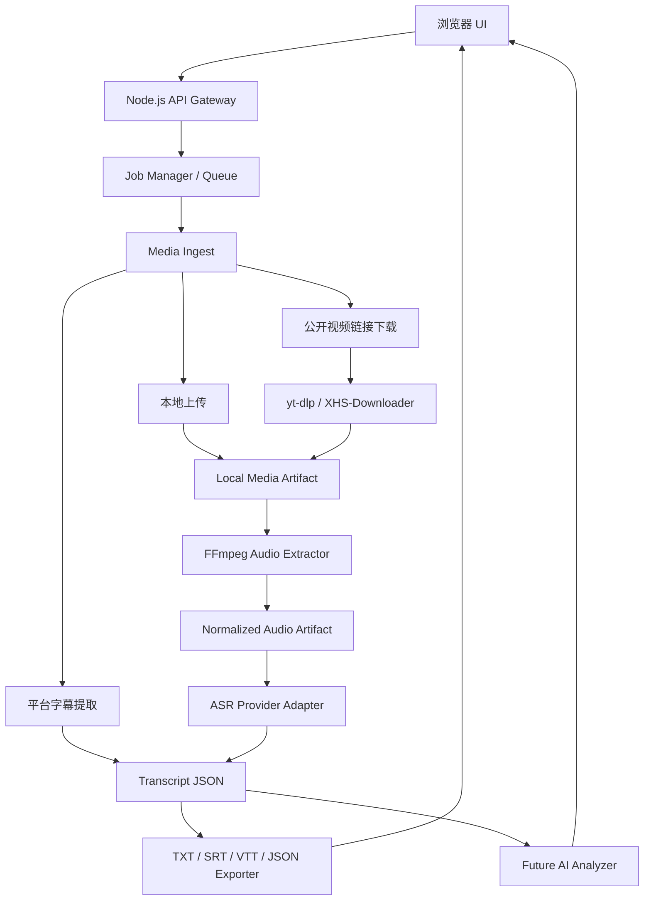
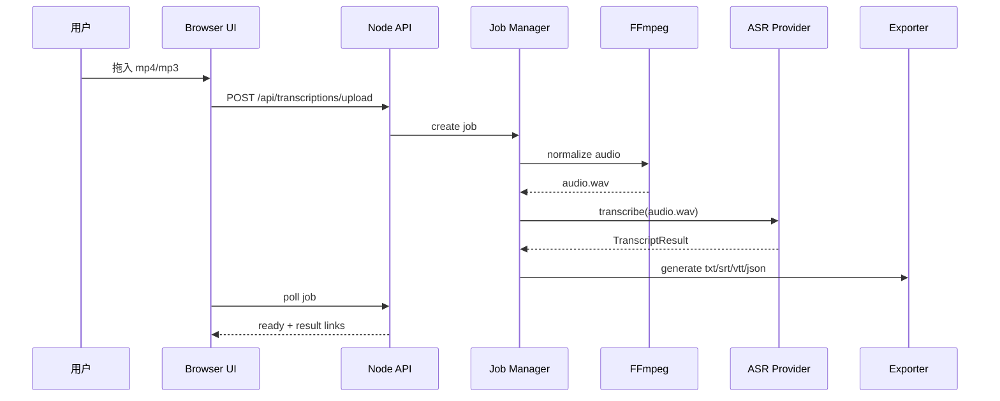
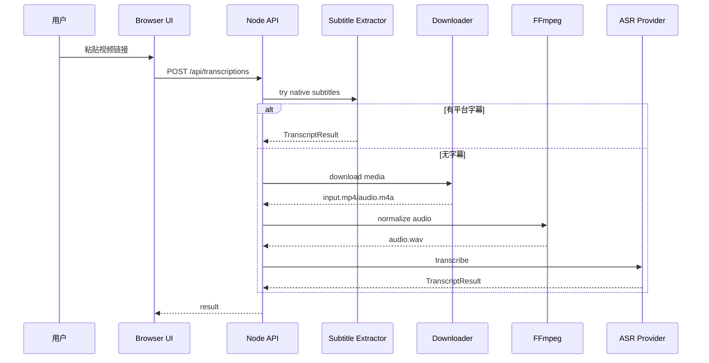

# Download Everything：视频转文字架构调研与推荐方案

版本：V0.1 草案  
日期：2026-06-26  
状态：架构建议，待确认后用于开发

## 1. 结论先行

你的产品不应该继续按“下载器加一个转写按钮”的方式往里塞功能。更合理的定位是：

> 一个媒体内容处理流水线：输入视频/音频/链接，产出可下载媒体、可搜索转录、字幕文件、AI 总结和复盘报告。

因此架构上建议采用：

> Node.js Web 主服务 + 模块化媒体流水线 + 可插拔 ASR Provider + 可升级任务队列 + 标准化结果产物。

第一版仍然保持简单，不上复杂微服务；但代码边界一开始就按“以后能换 ASR、能加队列、能加 AI 分析、能加账号和付费”来设计。

## 2. 调研过的开源项目

以下项目都和“视频/音频转文字、字幕生成、在线视频转录、AI 总结”有关。我重点看它们的架构共性，而不是照抄某一个项目。

| 项目 | 主要特点 | 对我们的启发 |
| --- | --- | --- |
| [AI-Video-Transcriber](https://github.com/wendy7756/AI-Video-Transcriber) | 支持 URL 和本地上传；优先读取平台原生字幕，失败再用 Whisper；包含转录、翻译、总结 | “字幕优先，ASR 兜底”很适合 YouTube/B站，能显著节省时间和成本 |
| [localcaption](https://github.com/jatinkrmalik/localcaption) | 极简三段式：yt-dlp 下载、FFmpeg 转 16k mono WAV、whisper.cpp 本地转录 | 每个模块只包一个外部工具，职责非常清楚，适合我们学习 |
| [whisper-video-to-text](https://github.com/daryllundy/whisper-video-to-text) | 本地推理、FFmpeg 统一音频、内存任务队列、SRT/VTT 输出 | 证明本地单进程工具可以先用内存 job store，未来再换 Redis/数据库 |
| [Whisper-WebUI](https://github.com/jhj0517/Whisper-WebUI) | Web UI；支持文件、YouTube、麦克风；可选择 openai/whisper、faster-whisper、insanely-fast-whisper；支持 SRT/VTT/txt | ASR 后端必须可插拔，输入类型也要统一抽象 |
| [whispr](https://github.com/franckferman/whispr) | CLI + Web UI 共用一套 pipeline；多后端；长文件分块；失败重试和 fallback backend | 我们后续做长视频、面试复盘时，需要“分块、重试、兜底 Provider” |
| [WhisperX](https://github.com/m-bain/whisperX) | VAD、批量推理、词级时间戳、说话人分离 | 面试复盘高级版需要词级时间戳和说话人分离，但第一版不应该直接上 |
| [Subs AI](https://github.com/absadiki/subsai) | Web UI + CLI + Python package；支持多种 Whisper 变体、字幕编辑、翻译、多字幕格式 | 工具层、UI 层、Python 包分层是成熟方向 |
| [WAAS](https://github.com/schibsted/waas) | 上传后后台转录，完成后给下载链接；浏览器本地编辑转录 | 结果编辑器可以放在后续阶段，不要塞进 MVP |
| [faster-whisper-server](https://github.com/nirnaim/faster-whisper-server) | FastAPI + Celery + Redis，支持流式和后台队列 | 如果未来有多人使用或付费，就要从内存队列升级到 Redis/Worker |
| [OpenAI Whisper](https://github.com/openai/whisper) / [faster-whisper](https://github.com/SYSTRAN/faster-whisper) / [whisper.cpp](https://github.com/ggml-org/whisper.cpp) | ASR 基础能力和不同性能路线 | Provider 层必须能容纳云端 API、本地 Python、本地 C++ 三种路线 |

## 3. 开源项目的架构共性

### 3.1 它们都把输入层和转写层拆开

成熟项目不会让 ASR 直接关心“这是 YouTube 还是本地 mp4”。它们先把输入统一变成一个本地媒体文件或音频文件。

常见输入：

- 本地音频。
- 本地视频。
- YouTube / B站 / TikTok 等 URL。
- 已存在字幕文件。
- 麦克风录音。
- 纯文本转后续总结。

对我们的结论：

- 小红书、B站、YouTube、抖音下载解析属于 `MediaSource` 层。
- 转写服务只吃“本地音频文件 + 元数据”，不要直接吃平台链接。

### 3.2 它们都依赖 FFmpeg 做标准化

几乎所有项目都会先用 FFmpeg 统一音频格式。常见目标格式：

```bash
ffmpeg -i input.mp4 -vn -ac 1 -ar 16000 output.wav
```

原因：

- 避免 ASR Provider 处理各种编码细节。
- 单声道、16kHz 对语音识别足够稳定。
- 失败点更容易定位：到底是视频下载失败、音频抽取失败，还是 ASR 失败。

对我们的结论：

- 必须有独立 `AudioExtractor` 模块。
- 所有 Provider 默认接收标准化后的音频。

### 3.3 它们都支持多种输出格式

常见输出：

- TXT：给人读。
- SRT：传统字幕。
- VTT：网页字幕。
- JSON：给程序、AI、搜索和复盘使用。

对我们的结论：

- 内部统一保存 `Transcript JSON`。
- TXT/SRT/VTT 都由 JSON 派生生成。
- 不要让每个 Provider 自己生成一堆不同格式，否则后期会乱。

### 3.4 成熟项目都在做 Provider 抽象

常见 ASR 后端：

- OpenAI Whisper。
- faster-whisper。
- whisper.cpp。
- WhisperX。
- OpenAI API / 兼容 API。
- 讯飞、阿里、腾讯、火山等云端 ASR。

对我们的结论：

- 第一版即使只接一个 ASR，也要设计 `TranscriptionProvider` 接口。
- Provider 返回值必须标准化为同一种 `TranscriptResult`。

### 3.5 长视频需要分块、重试和恢复

whispr 这类项目会做 chunk processing、worker count、retry、fallback backend。原因很现实：

- 长视频一次转写容易超时。
- 云端 API 可能中断。
- 本地模型可能内存不够。
- 某个片段失败不应该毁掉整个任务。

对我们的结论：

- MVP 可以先不做分块。
- 但任务模型里要预留 `segments/chunks` 概念。
- 第二阶段必须加分块和重试。

### 3.6 任务系统一开始可以简单，但边界要留好

很多本地工具用内存队列，因为单人使用够用；生产级项目用 Redis、Celery、数据库。

对我们的结论：

- 你现在这个工具先用内存任务队列是合理的。
- 但 Job Store 要封装起来，未来可以替换成 SQLite / Redis。
- API 不要暴露内部 Map 结构。

### 3.7 字幕优先是重要优化

AI-Video-Transcriber 明确采用 “Subtitle-First Architecture”：平台有原生字幕时直接拿字幕，没有字幕再跑 Whisper。

对我们的结论：

- 对 YouTube/B站，优先尝试提取已有字幕。
- 失败再下载音频转写。
- 对小红书/抖音，大概率没有标准字幕，直接走音频抽取 + ASR。

这会带来三个好处：

- 更快。
- 更省钱。
- 长视频更稳定。

## 4. 你的项目适合哪种架构

你现在的项目已经是 Node.js + Express，并且已经有：

- 浏览器 UI。
- 下载任务。
- yt-dlp。
- XHS-Downloader。
- 临时文件。
- 过期清理。

所以不建议重写成纯 Python 项目。更合理的是：

> Node.js 继续做产品入口、任务编排和网页；Python/C++/云端 API 作为可替换的 ASR Provider。

## 5. 推荐总体架构



核心思想：

- UI 不直接关心底层模型。
- 下载器不关心转写。
- ASR 不关心视频来自哪个平台。
- 导出器不关心 Provider 是讯飞还是 Whisper。
- AI 复盘只消费标准化文本，不碰媒体文件。

## 6. 推荐模块拆分

建议目录结构：

```text
download-everything/
  server.mjs
  public/
    index.html
    app.js
    styles.css
  lib/
    core/
      job-store.mjs
      artifact-store.mjs
      limits.mjs
      errors.mjs
    media/
      source-detector.mjs
      upload-ingest.mjs
      url-ingest.mjs
      subtitle-extractor.mjs
      audio-extractor.mjs
    transcription/
      transcript-schema.mjs
      transcription-service.mjs
      providers/
        fake-provider.mjs
        xunfei-provider.mjs
        openai-provider.mjs
        local-whisper-provider.mjs
      exporters/
        txt.mjs
        srt.mjs
        vtt.mjs
        json.mjs
    ai/
      analysis-service.mjs
      prompts/
        interview-review.md
        study-notes.md
  scripts/
    setup-ytdlp.mjs
    setup-xhs.mjs
    setup-transcription.mjs
  runtime/
    downloads/
    transcriptions/
      jobs/
        <job-id>/
          source.json
          input.mp4
          audio.wav
          transcript.json
          transcript.txt
          transcript.srt
          transcript.vtt
```

### 6.1 `core/job-store.mjs`

负责：

- 创建任务。
- 查询任务。
- 更新进度。
- 取消任务。
- 任务过期。

第一版用内存 Map；未来替换 SQLite/Redis。

### 6.2 `core/artifact-store.mjs`

负责：

- 每个任务的工作目录。
- 输入文件路径。
- 音频文件路径。
- 转录 JSON 路径。
- 导出文件路径。
- 清理临时文件。

这样文件管理不会散落在各个接口里。

### 6.3 `media/url-ingest.mjs`

负责把公开视频链接变成本地媒体文件，复用现有：

- yt-dlp。
- XHS-Downloader。
- 小红书直链下载。

输出统一为：

```js
{
  type: 'media',
  mediaPath: '/runtime/transcriptions/jobs/<id>/input.mp4',
  title: 'xxx',
  platform: 'YouTube',
  metadata: {}
}
```

### 6.4 `media/subtitle-extractor.mjs`

负责字幕优先策略。

支持：

- YouTube/B站已有字幕。
- 用户上传 `.srt` / `.vtt` / `.txt`。

输出统一为 `TranscriptResult`。

### 6.5 `media/audio-extractor.mjs`

负责 FFmpeg。

输入：

```js
{ mediaPath, jobId }
```

输出：

```js
{
  audioPath: '/runtime/transcriptions/jobs/<id>/audio.wav',
  duration: 1830.52,
  codec: 'pcm_s16le',
  sampleRate: 16000,
  channels: 1
}
```

### 6.6 `transcription/providers/*`

每个 Provider 只负责一件事：把音频转成标准结果。

统一接口：

```js
export class TranscriptionProvider {
  async transcribe({ audioPath, language, options, signal }) {
    return {
      provider: 'xunfei',
      language: 'zh-CN',
      duration: 0,
      text: '',
      segments: [
        {
          index: 0,
          start: 0,
          end: 4.2,
          text: '',
          speaker: null,
          words: []
        }
      ],
      raw: {}
    };
  }
}
```

### 6.7 `transcription/exporters/*`

只负责把标准 `TranscriptResult` 转成文件。

不要让 Provider 直接生成 SRT/VTT。

## 7. 推荐处理流程

### 7.1 本地文件上传转写



### 7.2 在线链接转写



## 8. Provider 选择建议

### 8.1 第一版：Fake Provider + 一个真实 Provider

第一步一定要先做 Fake Provider。

原因：

- 不依赖 API Key。
- 不产生费用。
- 可以先把上传、进度、导出、UI 全部跑通。
- 自动化测试更稳定。

Fake Provider 返回固定结构：

```js
{
  text: '这是一段测试转录。',
  segments: [
    { start: 0, end: 2, text: '这是一段测试转录。' }
  ]
}
```

### 8.2 真实 Provider 推荐顺序

我建议真实 Provider 顺序：

1. OpenAI-compatible Whisper API 或 OpenAI Audio API：开发体验最简单，结果结构清晰。
2. 讯飞 API：中文场景稳定，但接口鉴权、回调或分片协议可能更复杂。
3. 本地 faster-whisper：隐私和长期成本好，但安装和算力要求高。
4. WhisperX：等你需要词级时间戳和说话人分离时再上。

如果你的目标是最快拿到可用产品，先云端 API；如果你的目标是面试隐私，本地模型优先级会升高。

## 9. 当前项目的推荐演进路径

### Stage 0：保留现有下载器

不要推翻当前下载功能。它是 `url-ingest` 的基础。

当前已有能力：

- 下载任务。
- 小红书解析。
- yt-dlp。
- 临时文件清理。

### Stage 1：抽出任务和文件管理

先重构小一点：

- `job-store.mjs`
- `artifact-store.mjs`
- `media/audio-extractor.mjs`

这一步不改变 UI，但为转写做地基。

### Stage 2：本地文件转写 MVP

实现：

- 上传接口。
- FFmpeg 抽音频。
- Fake Provider。
- 转录结果 JSON。
- TXT/SRT/VTT/JSON 导出。

这是最稳的一步，因为不受平台风控影响。

### Stage 3：接真实 ASR Provider

实现：

- `OPENAI_API_KEY` 或 `XUNFEI_APP_ID / API_KEY / API_SECRET`。
- Provider 配置检查。
- 真实转录。
- 错误提示。

### Stage 4：在线视频转写

实现：

- YouTube/B站优先字幕。
- 无字幕再下载音频。
- 小红书/抖音下载后抽音频。

### Stage 5：AI 分析

实现：

- 学习总结。
- 面试复盘。
- 内容提炼。
- 问答卡片。

## 10. 为什么不建议一开始做复杂微服务

你现在是一个人开发，一个本地/小范围工具。上来就做 Redis、Celery、多 Worker、数据库、用户系统，会让项目变重。

更现实的路线是：

```text
第一阶段：模块化单体
第二阶段：SQLite 持久化
第三阶段：ASR Worker 独立进程
第四阶段：Redis Queue + 多 Worker
第五阶段：用户系统 + 额度 + 付费
```

这样既不会把第一版拖死，也不会把未来堵死。

## 11. 关键设计决策

### 11.1 内部标准结果必须先定

这是整个系统最重要的“骨架”。

建议标准 `TranscriptResult`：

```json
{
  "schemaVersion": 1,
  "jobId": "uuid",
  "source": {
    "type": "upload | url | subtitle",
    "platform": "local | youtube | bilibili | xiaohongshu | douyin",
    "title": "标题",
    "url": "原始链接，可选",
    "filename": "原始文件名，可选"
  },
  "audio": {
    "duration": 1830.52,
    "sampleRate": 16000,
    "channels": 1
  },
  "transcription": {
    "provider": "fake | openai | xunfei | faster-whisper | whisper-cpp",
    "language": "zh-CN",
    "text": "完整文本",
    "segments": [
      {
        "index": 0,
        "start": 0.0,
        "end": 5.2,
        "speaker": null,
        "text": "片段文本",
        "words": []
      }
    ]
  },
  "createdAt": "2026-06-26T00:00:00.000Z"
}
```

只要这个结构稳定，后面 AI 复盘、全文搜索、字幕导出、历史记录都能接。

### 11.2 Job 状态要比现在更细

建议状态：

```text
queued
processing
ready
failed
cancelled
expired
```

建议 stage：

```text
validating
uploading
extracting-subtitles
downloading-media
extracting-audio
transcribing
formatting
analyzing
done
```

用户看到的是 stage message，不是底层错误堆栈。

### 11.3 先轮询，后 SSE/WebSocket

当前项目用轮询查任务状态。第一版可以继续轮询。

未来如果要更顺滑：

- SSE 用于单向进度推送。
- WebSocket 用于实时日志。

但第一版不必做。

### 11.4 先临时文件，后历史库

第一版：

- 文件和转录结果 30 分钟过期。
- 不做登录，不做历史。

第二版：

- SQLite 保存任务历史。
- 用户可以手动删除。

商业版：

- 用户账号。
- 云存储。
- 额度计费。

## 12. API 推荐设计

### 12.1 创建转写任务：URL

```http
POST /api/transcriptions
Content-Type: application/json

{
  "url": "https://www.youtube.com/watch?v=...",
  "language": "auto",
  "provider": "fake",
  "mode": "subtitle-first"
}
```

### 12.2 创建转写任务：上传

```http
POST /api/transcriptions/upload
Content-Type: multipart/form-data

file=<binary>
language=auto
provider=fake
```

### 12.3 查询任务

```http
GET /api/transcriptions/:id
```

返回：

```json
{
  "id": "uuid",
  "status": "processing",
  "stage": "transcribing",
  "progress": 64,
  "message": "正在转写音频…",
  "createdAt": "2026-06-26T00:00:00.000Z",
  "expiresAt": null
}
```

### 12.4 获取结果

```http
GET /api/transcriptions/:id/result
```

返回标准 `TranscriptResult`。

### 12.5 导出

```http
GET /api/transcriptions/:id/export/txt
GET /api/transcriptions/:id/export/srt
GET /api/transcriptions/:id/export/vtt
GET /api/transcriptions/:id/export/json
```

## 13. 技术选型建议

### 13.1 Node.js 继续做主服务

原因：

- 当前项目已经是 Node。
- UI/API/下载任务都在这里。
- 改动小。

### 13.2 FFmpeg 作为系统依赖

不要把 FFmpeg 打包进项目。

原因：

- 跨平台维护成本高。
- 开源项目普遍要求用户安装系统 FFmpeg。
- README 和 setup 检查即可。

### 13.3 ASR Provider 两条路并存

云端 Provider：

- 快速。
- 不吃本机算力。
- 有成本和隐私问题。

本地 Provider：

- 隐私好。
- 长期成本低。
- 安装和性能复杂。

所以 Provider 抽象非常关键。

### 13.4 任务队列第一版用内存

第一版：

- `Map`
- `Array queue`
- 单并发

未来：

- SQLite 保存任务状态。
- Redis + Worker 多并发。

## 14. 风险与对应架构措施

| 风险 | 架构措施 |
| --- | --- |
| 小红书/抖音链接不稳定 | 本地上传入口必须是一等公民；在线链接只是增强 |
| ASR 服务以后可能换 | Provider Adapter 抽象 |
| 长视频慢或失败 | 预留 chunk model；第二阶段加分块和重试 |
| 成本不可控 | 字幕优先；文件大小/时长限制；Provider 配额 |
| 隐私敏感 | 本地模式/临时文件/明确提示云端处理 |
| 文件散落难清理 | Artifact Store 统一管理 |
| UI 越来越复杂 | 下载、转写、AI 分析三个 Tab 或三个 mode |

## 15. 最终推荐架构

我建议你采用“渐进式模块化单体”：

```text
当前阶段：
Node.js Express 单服务
  ├── Download Pipeline
  ├── Transcription Pipeline
  ├── Job Store
  ├── Artifact Store
  └── Provider Adapters

未来阶段：
Node.js Web/API
  ├── Redis/SQLite Job Store
  ├── Media Worker
  ├── ASR Worker
  └── AI Analysis Worker
```

一句话：

> 现在不要拆成微服务，但代码要按未来能拆的边界来写。

## 16. 第一版开发顺序建议

最稳的开发顺序：

1. 新增 `lib/core/job-store.mjs` 和 `lib/core/artifact-store.mjs`。
2. 新增 `lib/media/audio-extractor.mjs`，检查 FFmpeg。
3. 新增 `lib/transcription/transcript-schema.mjs`。
4. 新增 Fake Provider。
5. 新增 TXT/SRT/VTT/JSON Exporter。
6. 新增上传接口。
7. 前端新增“转文字”Tab 和拖拽上传。
8. 用 fake provider 写自动化测试。
9. 接真实 ASR Provider。
10. 再串在线视频链接转写。

## 17. 我建议你现在确认的架构问题

你不用懂全部技术细节，只需要确认三个产品取舍：

1. 第一版是否接受“先本地文件转写，在线视频转写第二步接入”？
2. 第一版真实 ASR 更倾向：
   - 云端 API，快但有成本和隐私提示；
   - 本地模型，隐私好但安装慢；
   - 两者都支持，但开发稍慢。
3. 未来是否希望保留历史记录？
   - 如果希望，第二阶段应引入 SQLite；
   - 如果不希望，继续 30 分钟临时任务即可。

## 18. 我的建议

我建议你选：

- 架构：渐进式模块化单体。
- 第一版输入：本地文件上传。
- 第一版 Provider：Fake Provider + 一个云端 Provider。
- 第二版 Provider：本地 faster-whisper 或 whisper.cpp。
- 在线视频：字幕优先，然后下载音频 ASR。
- 存储：第一版临时文件，第二版 SQLite 历史。

这样会比较像一个真正能长大的产品，而不是一个临时脚本。

