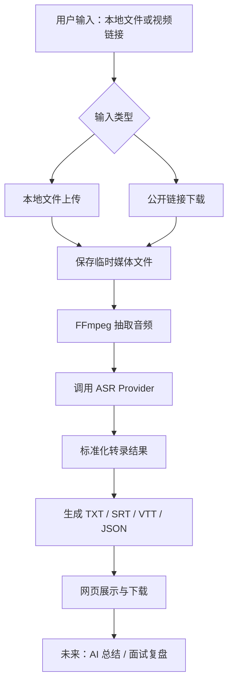

# Download Everything：视频转文字与 AI 复盘功能需求文档

版本：V0.1 草案  
日期：2026-06-26  
状态：待确认后进入开发

相关架构文档：[`transcription-architecture-research.md`](./transcription-architecture-research.md)

## 1. 一句话定位

把 YouTube、Bilibili、小红书、抖音、本地视频和面试录音里的声音，转成可阅读、可搜索、可导出、可交给 AI 分析的文字资料。

它不是单纯的“视频下载工具”，而是一个“内容消化工具”：帮助用户把看过的视频、课程、访谈、面试、会议和复盘素材，变成可以长期保存和二次加工的文字资产。

## 2. 可直接用于开发的 Prompt

下面这段可以作为后续正式开发时给 Codex 的任务 Prompt：

```text
请在当前 Download Everything 项目中新增“视频/音频转文字”能力。

目标：
用户可以在浏览器里拖入本地视频/音频文件，或粘贴 YouTube、Bilibili、小红书、抖音等公开链接。系统先获得媒体文件或音频流，再抽取音频，调用可配置的语音转文字服务生成转录文本。转录结果需要展示在网页中，并支持导出 TXT、SRT、VTT、JSON。未来可把转录结果交给 AI 做学习总结、面试复盘、内容提炼和问答分析。

MVP 范围：
1. 支持本地文件拖拽上传，至少支持 mp4、mov、m4a、mp3、wav。
2. 支持对当前下载器已能下载到本地的在线视频进行转录。
3. 使用 FFmpeg 抽取音频，统一转为适合 ASR 的音频格式。
4. 设计 ASR Provider 抽象层，第一版可以先接一个实际服务，例如讯飞 API、OpenAI Whisper/API、或本地 faster-whisper；Provider 需要可替换。
5. 前端新增“转文字”入口，显示任务状态、进度、转录文本、时间轴片段、导出按钮。
6. 后端新增转录任务队列，限制并发、限制文件大小、自动清理临时文件。
7. 不做登录、不做云端永久存储、不做用户系统。

验收标准：
- 拖入一个本地 mp4，可以完成上传、抽音频、转录、展示文本。
- 粘贴一个已支持下载的视频链接，可以下载后自动转录。
- 转录完成后可以导出 TXT、SRT、VTT、JSON。
- 失败时给出明确原因，例如文件过大、格式不支持、ASR Key 未配置、转录服务超时。
- 所有临时文件在任务过期后自动删除。
- 不影响现有下载功能。
```

## 3. 为什么这个功能值得做

用户真实痛点：

- 看视频容易，吸收困难。很多 YouTube、B站、小红书内容有价值，但看完就散了，很难沉淀。
- 面试复盘很依赖完整记录。只靠记忆容易遗漏真实表达、追问点、卡顿点和回答逻辑。
- 学习资料需要二次整理。课程、播客、访谈、讲座转成文字后，才方便搜索、标注、总结和复习。
- 内容创作者需要素材再利用。视频转文字后可以生成笔记、脚本、摘要、标题、社媒文案。
- 很多人愿意为“省时间”付费，但第一版如果免费可用，会更容易积累真实使用反馈。

产品价值：

- 从“下载内容”升级为“理解内容”。
- 从“保存视频文件”升级为“保存知识文本”。
- 后续可以自然接入 AI 总结、知识库、面试评估、简历优化和个人学习档案。

## 4. 目标用户与典型场景

### 4.1 个人学习者

用户粘贴 YouTube 或 B站课程链接，系统下载/抽音频/转写，输出完整字幕与摘要。用户可以复制重点，交给 AI 整理成学习笔记。

### 4.2 面试者

用户上传面试录音或录屏，系统转成逐字稿。未来 AI 可以分析回答结构、表达清晰度、追问风险点、STAR 案例完整度和改进建议。

### 4.3 内容创作者

用户上传自己的视频，获得文字稿、字幕文件和短内容素材。后续可生成标题、摘要、分段、小红书笔记、公众号草稿。

### 4.4 研究/咨询/销售复盘

用户上传访谈、会议、用户调研录音，转成可搜索文本。后续可提取问题、观点、需求、异议、结论和行动项。

## 5. MVP 功能范围

第一阶段目标是跑通“视频/音频 → 转录文本 → 导出”的主链路，不追求一次做成商业级。

### 5.1 输入方式

必须支持：

- 本地文件拖拽上传。
- 本地文件选择上传。
- 粘贴当前项目已支持的视频链接，完成下载后进入转录。

建议支持的文件格式：

- 视频：mp4、mov、mkv、webm。
- 音频：mp3、m4a、wav、aac、flac。

第一版限制：

- 单文件建议限制 500 MB 或 2 小时以内。
- 同时只处理 1 个转录任务。
- 不保存历史记录，任务完成后临时保存 30 分钟。

### 5.2 转录输出

必须输出：

- 纯文本全文。
- 分段文本，每段带开始时间和结束时间。
- 可复制文本。
- 可下载 TXT。
- 可下载 SRT。
- 可下载 VTT。
- 可下载 JSON。

推荐 JSON 结构：

```json
{
  "id": "job-id",
  "sourceType": "upload | url",
  "filename": "interview.mp4",
  "language": "zh-CN",
  "duration": 1830.52,
  "provider": "xunfei | openai | local-whisper",
  "text": "完整转录文本",
  "segments": [
    {
      "index": 1,
      "start": 0.0,
      "end": 5.2,
      "speaker": null,
      "text": "第一段转录文字"
    }
  ],
  "createdAt": "2026-06-26T10:00:00.000Z"
}
```

### 5.3 页面体验

新增一个“转文字”区域，和下载功能平级。

建议页面结构：

- 顶部仍保留当前治愈风格标题。
- 输入区分为两个 Tab：
  - 粘贴视频链接。
  - 拖入本地文件。
- 任务卡片显示：
  - 正在上传。
  - 正在抽取音频。
  - 正在转写。
  - 正在整理字幕。
  - 已完成。
- 结果区显示：
  - 完整文本。
  - 时间轴分段。
  - 导出按钮。
  - 复制全文按钮。
  - 未来预留“AI 总结 / 面试复盘”按钮。

推荐 UI 文案：

- “把声音变成可回看的文字。”
- “你不需要记住全部，只需要把它留下来。”
- “适合课程、访谈、面试、播客和复盘。”
- “转写完成后，文字会暂存 30 分钟。”

## 6. 非 MVP：先不做什么

第一阶段暂时不做：

- 登录系统。
- 云端永久保存历史。
- 在线多人协作。
- 复杂会员/付费系统。
- 批量上传。
- 自动分离多人说话人。
- 自动生成完整商业报告。
- 绕过平台访问限制或 DRM。

这些都可以做，但不应该抢第一阶段主链路的注意力。

## 7. 技术方案

### 7.1 当前项目基础

当前项目已经具备：

- Node.js + Express 服务。
- 浏览器页面。
- 下载任务队列。
- yt-dlp 下载 YouTube、Bilibili、抖音等公开媒体。
- XHS-Downloader 解析小红书。
- 临时文件保存和过期清理。

转录功能可以复用这些基础能力。

### 7.2 新增核心流程



### 7.3 后端模块设计

建议新增文件：

```text
server.mjs
public/app.js
public/index.html
public/styles.css
lib/transcription/
  audio.mjs
  providers/
    base.mjs
    xunfei.mjs
    openai.mjs
    local-whisper.mjs
  subtitles.mjs
  transcript-store.mjs
test/transcription-flow.test.mjs
```

如果不想引入太多文件，第一版也可以先放在 `server.mjs`，但为了后续扩展，建议拆出 `lib/transcription`。

### 7.4 后端 API 设计

#### 创建链接转录任务

```http
POST /api/transcriptions
Content-Type: application/json

{
  "url": "https://www.youtube.com/watch?v=...",
  "language": "zh-CN",
  "provider": "xunfei"
}
```

#### 创建本地上传转录任务

```http
POST /api/transcriptions/upload
Content-Type: multipart/form-data

file=<binary>
language=zh-CN
provider=xunfei
```

#### 查询任务状态

```http
GET /api/transcriptions/:id
```

返回：

```json
{
  "id": "job-id",
  "status": "queued | processing | ready | failed",
  "stage": "uploading | extracting-audio | transcribing | formatting | done",
  "progress": 42,
  "message": "正在转写音频…",
  "duration": 1830.52,
  "filename": "interview.mp4",
  "exports": {
    "txt": "/api/transcriptions/job-id/export.txt",
    "srt": "/api/transcriptions/job-id/export.srt",
    "vtt": "/api/transcriptions/job-id/export.vtt",
    "json": "/api/transcriptions/job-id/export.json"
  }
}
```

#### 获取转录结果

```http
GET /api/transcriptions/:id/result
```

#### 导出文件

```http
GET /api/transcriptions/:id/export.txt
GET /api/transcriptions/:id/export.srt
GET /api/transcriptions/:id/export.vtt
GET /api/transcriptions/:id/export.json
```

#### 删除任务

```http
DELETE /api/transcriptions/:id
```

### 7.5 任务状态机

```text
queued
  -> processing: downloading
  -> processing: extracting-audio
  -> processing: transcribing
  -> processing: formatting
  -> ready
  -> expired

任何 processing 阶段都可能进入 failed。
用户取消则进入 cancelled，并删除临时文件。
```

### 7.6 FFmpeg 音频抽取

建议统一转为：

```bash
ffmpeg -i input.mp4 -vn -ac 1 -ar 16000 -f wav output.wav
```

原因：

- 大多数 ASR 服务更适合单声道。
- 16kHz 对语音转写通常足够。
- wav 兼容性好，但文件较大。

如果 provider 更适合压缩格式，可以改为：

```bash
ffmpeg -i input.mp4 -vn -ac 1 -ar 16000 -b:a 64k output.m4a
```

第一版建议先用 wav，简单可靠。

### 7.7 ASR Provider 抽象

需要设计统一接口，避免被某一家 API 绑死。

```js
class TranscriptionProvider {
  async transcribe({ audioPath, language, signal }) {
    return {
      text: '',
      language: 'zh-CN',
      duration: 0,
      segments: [
        { start: 0, end: 3.2, text: '...', speaker: null }
      ],
      raw: {}
    };
  }
}
```

候选 Provider：

| Provider | 优点 | 风险/限制 | 适合阶段 |
| --- | --- | --- | --- |
| 讯飞 API | 中文语音识别成熟，国内访问稳定 | 需要申请 Key，接口和计费需要单独确认 | 中文 MVP |
| OpenAI Whisper/API | 效果稳定，多语言好，开发体验好 | 访问与费用取决于账号和网络环境 | 多语言/英文视频 |
| 本地 faster-whisper | 数据不出本机，长期成本低 | 需要本机算力，安装稍复杂 | 私密面试复盘 |
| 阿里/腾讯/火山 ASR | 国内服务选择多 | 每家 API 格式不同 | 商业化备选 |

建议第一版策略：

- 先做 Provider 抽象。
- 先接一个最容易跑通的 Provider。
- 后续再增加其他 Provider。

## 8. 面试复盘能力设计

转录不是终点。真正有价值的是复盘。

### 8.1 MVP 后的 AI 分析入口

转录完成后，新增按钮：

- “生成面试复盘”
- “生成学习笔记”
- “提取重点”
- “生成问答卡片”

### 8.2 面试复盘输入

需要收集：

- 面试岗位。
- 面试类型：技术面、HR 面、业务面、模拟面试。
- 候选人背景，可选。
- 用户希望重点分析什么：
  - 表达逻辑。
  - 专业能力。
  - STAR 案例。
  - 沟通方式。
  - 卡顿和废话。
  - 面试官关注点。

### 8.3 面试复盘输出

建议输出结构：

```text
1. 总体评价
2. 回答亮点
3. 明显问题
4. 面试官可能在意的风险点
5. 回答结构优化建议
6. 可以重写的关键回答
7. 下次面试训练清单
8. 可复制的复盘总结
```

### 8.4 面试复盘 Prompt 草案

```text
你是一个严谨、直接、但支持性的面试复盘教练。

我会给你一段面试转录文本。请你基于文本进行复盘，不要编造没有出现的信息。

请输出：
1. 这场面试候选人的整体表现。
2. 候选人表达清晰的地方。
3. 候选人回答含糊、绕、弱或缺少证据的地方。
4. 面试官可能追问或担心的点。
5. 按 STAR 结构重写 3 个关键回答。
6. 给出下一次面试前最应该训练的 5 件事。
7. 用 200 字以内总结这场面试的核心复盘。

要求：
- 只基于转录文本判断。
- 不要空泛鼓励。
- 建议要具体、可执行。
- 如果信息不足，请明确说明不足在哪里。

转录文本：
{{transcript}}
```

## 9. 数据与隐私

因为面试录音、会议录音可能包含敏感信息，第一版必须明确：

- 默认只做临时文件。
- 默认不保存历史。
- 任务过期自动删除媒体、音频、转录结果。
- 页面提示用户不要上传无权处理的隐私内容。
- 如果接第三方 ASR，要明确“音频会发送到第三方服务”。
- 如果用户需要隐私优先，后续可接本地 faster-whisper。

建议页面提示：

```text
转写会处理你上传的视频或音频。若使用云端语音识别服务，音频会发送给对应服务商。请不要上传你无权处理的隐私内容。
```

## 10. 错误处理

常见失败场景：

| 场景 | 页面提示 |
| --- | --- |
| 文件太大 | 文件超过当前上限，请压缩或截取后再试。 |
| 格式不支持 | 当前不支持这个格式，请换成 mp4、mp3、wav、m4a。 |
| FFmpeg 未安装 | 服务器缺少 FFmpeg，无法抽取音频。 |
| ASR Key 未配置 | 转写服务尚未配置，请先设置 API Key。 |
| ASR 服务超时 | 转写服务暂时没有响应，请稍后重试。 |
| 视频无音轨 | 这个视频没有检测到可转写的音频。 |
| 下载失败 | 视频没有下载成功，无法进入转写。 |
| 用户取消 | 任务已取消，临时文件已清理。 |

## 11. 文件与存储策略

建议目录：

```text
runtime/
  downloads/
  transcriptions/
    jobs/
      <job-id>/
        input.mp4
        audio.wav
        transcript.json
        transcript.txt
        transcript.srt
        transcript.vtt
```

清理规则：

- 默认 30 分钟过期。
- 用户点击删除，立即清理。
- 服务启动时清理超过 24 小时的残留任务。

## 12. 前端交互草图

```text
┌──────────────────────────────────────────────┐
│ Download Everything In Just One Click!        │
│ 把声音变成可回看的文字。                     │
├──────────────────────────────────────────────┤
│ [ 下载内容 ] [ 转文字 ]                       │
├──────────────────────────────────────────────┤
│ 粘贴链接                                      │
│ https://...                                   │
│ [开始转写]                                    │
│                                              │
│ 或拖入视频/音频文件                           │
│ ┌──────────────────────────────────────────┐ │
│ │ 把 mp4 / mp3 / wav / m4a 拖到这里        │ │
│ └──────────────────────────────────────────┘ │
├──────────────────────────────────────────────┤
│ 正在抽取音频... 38%                          │
│ ███████░░░░░░░░░░░░                          │
├──────────────────────────────────────────────┤
│ 转录结果                                      │
│ [复制全文] [下载 TXT] [下载 SRT] [下载 JSON]  │
│                                              │
│ 00:00:00 - 00:00:05  大家好，今天我们聊...   │
│ 00:00:05 - 00:00:12  这个问题其实可以...     │
└──────────────────────────────────────────────┘
```

## 13. 验收标准

### 13.1 本地文件转录

- 用户拖入 mp4 文件。
- 页面显示上传进度。
- 后端保存临时文件。
- FFmpeg 成功抽取音频。
- ASR Provider 返回文本。
- 页面展示完整文本。
- 用户可以下载 TXT、SRT、VTT、JSON。

### 13.2 在线链接转录

- 用户粘贴当前项目支持的公开视频链接。
- 系统先下载媒体。
- 下载成功后进入音频抽取。
- 转录完成后展示结果。
- 原有单纯下载功能不受影响。

### 13.3 失败路径

- 未配置 ASR Key 时，页面明确提示。
- 文件过大时，任务不会进入转录。
- 用户取消任务后，临时文件删除。
- 任务过期后，下载结果不可访问。

### 13.4 自动化测试

至少新增：

- 上传一个测试音频，使用 fake ASR Provider 返回固定文本。
- 粘贴一个 fake 下载链接，下载后进入 fake ASR Provider。
- 导出 TXT/SRT/VTT/JSON 文件。
- 取消任务会清理文件。
- ASR Provider 报错时任务进入 failed。

## 14. 开发拆分

### Milestone 1：本地文件转文字

- 新增上传接口。
- 新增转录任务队列。
- 接入 FFmpeg 抽取音频。
- 实现 fake ASR Provider。
- 前端支持拖拽上传和结果展示。
- 完成自动化测试。

### Milestone 2：接入真实 ASR Provider

- 实现 Provider 配置。
- 接入一个真实服务，例如讯飞 API 或 OpenAI Whisper/API。
- 支持 API Key 缺失提示。
- 记录 provider 原始响应，便于调试。

### Milestone 3：在线视频转文字

- 复用现有下载功能。
- 下载完成后自动进入转录。
- 控制文件大小和任务超时。

### Milestone 4：AI 总结与面试复盘

- 转录完成后可点击“AI 复盘”。
- 用户选择场景：学习总结、面试复盘、内容提炼。
- 输出结构化分析。

### Milestone 5：产品化增强

- 登录与历史记录。
- 付费额度。
- 长视频切片转录。
- 说话人分离。
- 关键词搜索。
- 文本高亮回放。
- 个人知识库。

## 15. 商业化方向

这个功能有付费潜力，但建议先免费打磨真实需求。

可付费点：

- 长视频转录。
- 批量转录。
- 面试深度复盘。
- 多轮 AI 问答。
- 历史记录与知识库。
- 团队空间。
- 隐私优先本地模型部署。

免费版可以限制：

- 单文件时长。
- 每日转录次数。
- 导出格式。
- AI 分析次数。

## 16. 关键风险

| 风险 | 说明 | 规避方式 |
| --- | --- | --- |
| ASR 成本 | 长音频转写会产生费用 | 设置时长/大小限制，展示成本预期 |
| 平台链接不稳定 | 小红书/抖音可能风控 | 保留本地上传入口，在线链接作为增强 |
| 隐私风险 | 面试/会议内容敏感 | 默认临时保存，明确提示第三方处理 |
| 长视频性能 | 大文件处理慢 | 分段抽音频、队列、超时、进度 |
| 字幕时间轴质量 | 不同 ASR 返回格式不同 | 统一 segments 标准结构 |

## 17. 待你确认的问题

开发前建议你确认这几个点：

1. 第一版真实 ASR Provider 想先接哪一个？
   - 讯飞 API
   - OpenAI Whisper/API
   - 本地 faster-whisper
   - 先用 fake provider 跑通 UI，再接真实服务
2. 第一版更优先支持哪种输入？
   - 本地视频/音频拖入
   - 在线链接自动下载后转写
3. 转写结果是否需要永久保存？
   - 当前建议：第一版不保存，只临时 30 分钟。
4. 是否要优先做“面试复盘”按钮？
   - 当前建议：第一版先只转写，复盘作为第二阶段。

## 18. 推荐第一版决策

我建议第一版这样做：

- 优先做本地文件拖拽上传。
- 先接 fake ASR Provider，把完整链路和 UI 跑通。
- 同时把 Provider 接口设计好。
- 第二步接一个真实 ASR。
- 第三步再把“下载链接 → 转写”串起来。
- 面试复盘放在转写稳定后做。

理由：

- 本地文件入口最稳定，不受平台风控影响。
- fake provider 可以快速验证产品体验。
- Provider 抽象做好后，换讯飞、Whisper 或本地模型都不至于重写项目。
- 面试复盘依赖高质量转录，应该在转录链路稳定后再加。
